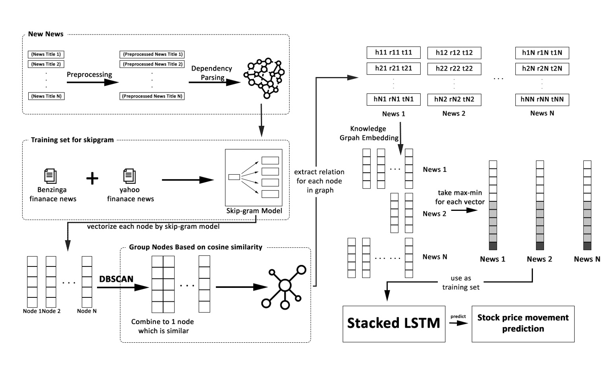

## Using Ontology-based NER and Knowledge Graph for Stock Price Prediction

##SKG-LSTM

### Dependencies

* Compatible with TensorFlow 1.x and Python 3.6.x.
* Dependencies can be installed using `requirements.txt`.

### Prepare Datasets

* Crawl data from Yahoo Finance.
* Download the Benzinga data from [Kaggle](https://www.kaggle.com/miguelaenlle/massive-stock-news-analysis-db-for-nlpbacktests).

